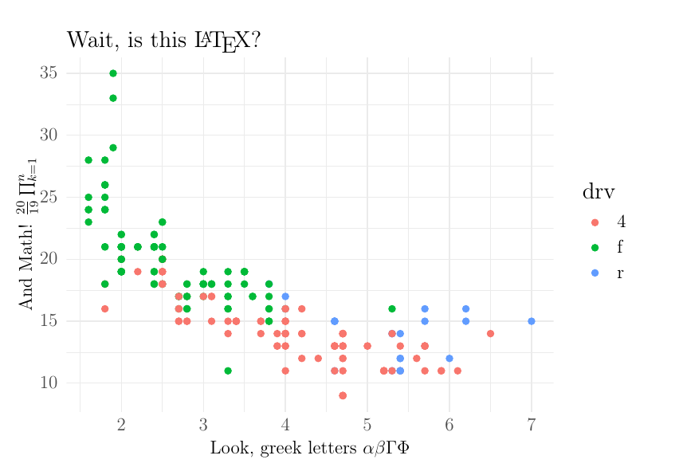

This repository stores some helper functions that I use.

# Save ggplot as tikz

This is handy for exporting ggplots to LaTeX with the `ggsave` framework and `last_plot`.

```{r}
library(ggplot2)
library(tikzDevice)
source("ggtiksave.R")

ggplot(mpg)+
  geom_point(aes(displ, cty, color = drv))+
  theme_minimal()+
  xlab("Look, greek letters $\\alpha \\beta \\Gamma \\Phi$")+
  ylab("And Math! $\\frac{20}{19} \\prod_{k=1}^n$ ")+
  ggtitle("Wait, is this \\LaTeX?")

ggtiksave("myplot.tex")
```


And this is the result if `myplot.tex` is `input` into a tex doc (with tikz loaded!).

